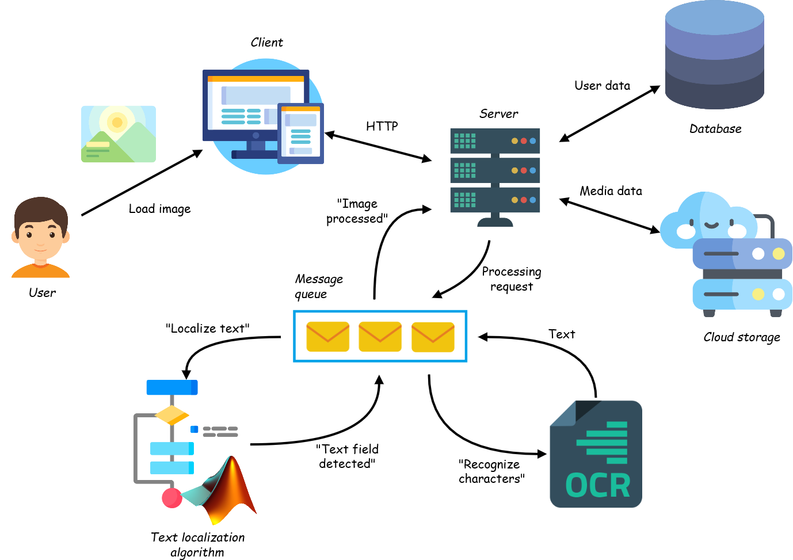

# Detextive

System of text areas localization on images using directional wavelets ([2-D CWT](https://www.mathworks.com/help/wavelet/ug/2-d-continuous-wavelet-transform-app.html#bt2e30m)). Thesis project.

Detextive is a user-oriented system that can determine the coordinates of a text area located at an arbitrary angle in a photo, recognize text and save the results in a way convenient for the user.  
The system is designed to solve the problem of finding text on natural images taken in non-ideal conditions, such as photos of billboards, labels, signs, etc.

**[detextive_server](https://github.com/kristina-solovyova/detextive_server)** - server side (Django app)  
**[detexive_client](https://github.com/kristina-solovyova/detextive_client)** - client side (Vue.js app)

## Demo

[Demo video](https://www.youtube.com/watch?v=Mxk-EyICI2o) is available on YouTube: https://www.youtube.com/watch?v=Mxk-EyICI2o

## Logical model

The system conditionally consists of such the components:
* user interface (Vue.js client app);
* server (Django app);
* database (PostgreSQL):
* cloud storage for uploaded images ([Cloudinary](https://cloudinary.com));
* a module for executing a text area localization algorithm (Matlab script);
* OCR (built-in [Matlab OCR](https://www.mathworks.com/help/vision/ref/ocr.html));
* message queue (Celery).

